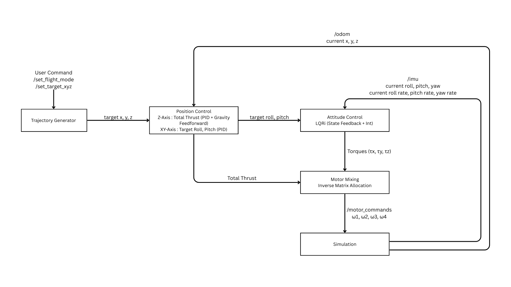
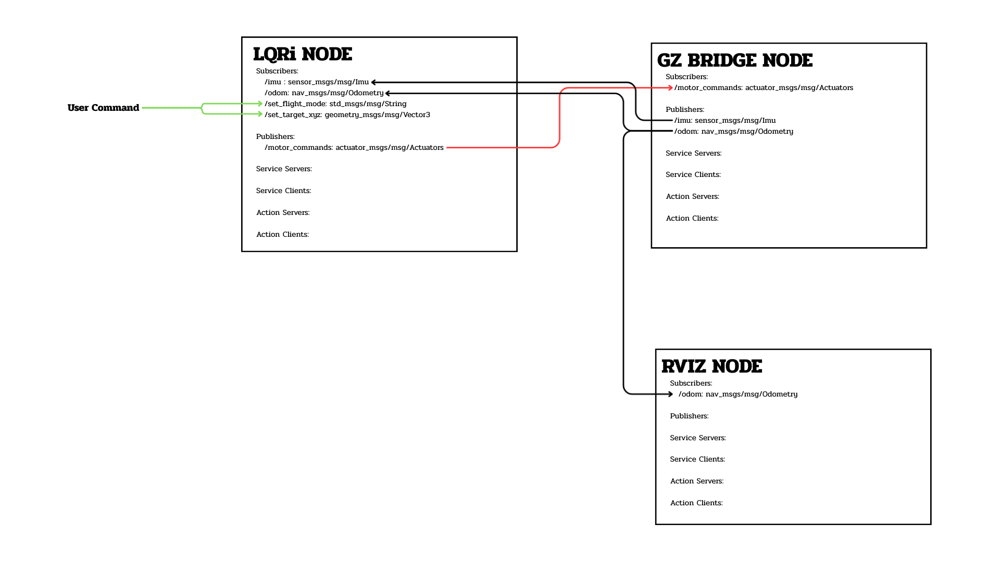

# LAB2: Quadrotor Control — LQRi & MPC

**Course:** FRA532 - Mobile Robot
**Team:** Pao-Pond Hero

A ROS2 quadrotor simulation with two control approaches: **LQRi** (LQR with integral action + PID position) and **MPC** (constrained QP via OSQP). Both controllers support hover, 2D, and 3D trajectory tracking in Gazebo Harmonic, tested with and without wind disturbance.

---

## Table of Contents

- [Prerequisites](#prerequisites)
- [Installation](#installation)
- [Build](#build)
- [Controller 1: LQRi](#controller-1-lqri)
  - [LQR Launch](#lqr-launch)
  - [LQR Node Overview](#lqr-node-overview)
  - [LQR Control Architecture](#lqr-control-architecture)
  - [LQR System Architecture](#lqr-system-architecture)
  - [LQR Attitude Controller](#lqr-attitude-controller)
  - [LQR Position Controller](#lqr-position-controller)
  - [LQR Altitude Controller](#lqr-altitude-controller)
  - [LQR Motor Mixing](#lqr-motor-mixing)
  - [LQR Flight Modes](#lqr-flight-modes)
  - [LQR Trajectory Modes](#lqr-trajectory-modes)
  - [LQR Tuning Parameters](#lqr-tuning-parameters)
- [Controller 2: MPC](#controller-2-mpc)
  - [MPC Launch](#mpc-launch)
  - [MPC Usage](#mpc-usage)
  - [MPC Plotting Flight Data](#mpc-plotting-flight-data)
  - [MPC Error Analysis](#mpc-error-analysis)
- [Project Structure](#project-structure)
- [Documentation](#documentation)

---

## Prerequisites

- **Ubuntu 22.04** (or compatible)
- **ROS2 Humble**
- **Gazebo Harmonic** (with `ros_gz` bridge packages)

---

## Installation

### 1. Install ROS2 Packages

```bash
sudo apt update
sudo apt install -y \
  ros-humble-ros-gz-sim \
  ros-humble-ros-gz-bridge \
  ros-humble-xacro \
  ros-humble-robot-state-publisher \
  ros-humble-rviz2 \
  ros-humble-actuator-msgs \
  ros-humble-plotjuggler-ros
```

### 2. Install Python Dependencies

```bash
pip3 install osqp numpy scipy matplotlib
```

### 3. Clone the Repository

```bash
cd ~
git clone -b Lab2 https://github.com/Pungpond3947/Mobile_Robot.git Mobile_Robot-Lab2
```

---

## Build

```bash
cd ~/Mobile_Robot-Lab2
colcon build
source install/setup.bash
```

> Add `source ~/Mobile_Robot-Lab2/install/setup.bash` to your `~/.bashrc` to auto-source on every terminal.

---

# Controller 1: LQRi

## LQR Launch

```bash
# No wind (default)
ros2 launch quad_description sim.launch.py

# With wind
# Change the world in sim.launch.py to wind.sdf, then:
colcon build
source install/setup.bash
ros2 launch quad_description sim.launch.py
```

---

## LQR Node Overview

### Node Name

```
lqri_trajectory_controller
```

### Subscribed Topics

| Topic | Message | Description |
|------|------|------|
| `/odom` | `nav_msgs/Odometry` | Position estimation |
| `/imu` | `sensor_msgs/Imu` | Orientation and angular velocity |
| `/set_target_xyz` | `geometry_msgs/Vector3` | Target position command |
| `/set_flight_mode` | `std_msgs/String` | Flight mode command |

### Published Topics

| Topic | Message | Description |
|------|------|------|
| `/motor_commands` | `actuator_msgs/Actuators` | Motor velocity commands |
| `/debug/current_xyz` | `geometry_msgs/Vector3` | Current position |
| `/debug/target_xyz` | `geometry_msgs/Vector3` | Target position |
| `/debug/current_rpy` | `geometry_msgs/Vector3` | Current attitude |
| `/debug/target_rpy` | `geometry_msgs/Vector3` | Target attitude |

---

## LQR Control Architecture

The control system uses a **nested control structure**.



---

## LQR System Architecture



---

## LQR State Variables

The controller estimates:

Position:
```
x, y, z
```

Orientation:
```
roll, pitch, yaw
```

Angular velocity:
```
p, q, r
```

Data comes from:

- `/odom`
- `/imu`

---

## LQR Attitude Controller

The inner loop uses **LQR with integral action**.

Augmented state:

```
x_aug =
[
∫e_roll
∫e_pitch
∫e_yaw
e_roll
e_pitch
e_yaw
p
q
r
]
```

Control input:

```
u = [τx τy τz]
```

Computed using:

```
u = -K x_aug
```

The gain matrix is computed using:

```
P = solve_continuous_are(A, B, Q, R)
K = R⁻¹ Bᵀ P
```

---

## LQR Position Controller

The outer loop converts **position error → attitude commands**.

### X axis

```
error_x = target_x - curr_x
```

Pitch command:

```
pitch_cmd =
kp_pos * error_x +
ki_pos * integral_x +
kd_pos * derivative_x
```

### Y axis

```
error_y = target_y - curr_y
```

Roll command:

```
roll_cmd =
-(kp_pos * error_y +
  ki_pos * integral_y +
  kd_pos * derivative_y)
```

---

## LQR Altitude Controller

Altitude uses PID control.

```
error_z = target_z - curr_z
```

Total thrust:

```
T = mg + PID_z
```

Where:

```
PID_z =
kp_z * error_z +
ki_z * integral_z +
kd_z * derivative_z
```

---

## LQR Motor Mixing

Quadrotor force vector:

```
F = [T τx τy τz]
```

Motor thrusts:

```
T_motor = M⁻¹ F
```

Motor speed:

```
ω = sqrt(T / kF)
```

Limited by:

```
ω ≤ ω_max
```

---

## LQR Flight Modes

| Mode | Description |
|-----|-----|
| `IDLE` | Motors OFF |
| `2D` | Motion in X-Z plane |
| `3D` | Full XYZ control |

### Select Flight Mode

```bash
ros2 topic pub --once /set_flight_mode std_msgs/String "{data: '3D'}"
```

### Send Target Position

```bash
ros2 topic pub --once /set_target_xyz geometry_msgs/Vector3 "{x: 2.0, y: 1.0, z: 2.0}"
```

### Stop the Drone

```bash
ros2 topic pub --once /set_flight_mode std_msgs/String "{data: 'IDLE'}"
```

---

## LQR Trajectory Modes

| Mode | Description |
|-----|-----|
| `2D_STRAIGHT_F` | Move forward along X axis (`x = x0 + 3t`) |
| `2D_STRAIGHT_B` | Move backward along X axis (`x = x0 - 3t`) |
| `2D_SINE` | Sine wave (`x = x0 + 0.3t`, `z = z0 + sin(0.5t)`) |
| `2D_RAMP_WAVE` | Triangle wave altitude (`z = z0 + 1.5 * triangle(t)`, `x = x0 + 0.8t`) |
| `3D_STRAIGHT` | Straight 3D motion (`x = x0 + vx*t`, `y = y0 + vy*t`, `z = z0 + vz*t`) |
| `3D_HELIX` | Helix spiral (`x = r*sin(ωt)`, `y = r*(1-cos(ωt))`, `z = z0 + vt`) |
| `3D_FIGURE8` | Figure-8 (`x = x0 + a*cos(ωt)/(1+sin²(ωt)) - a`, `y = y0 + a*sin(ωt)*cos(ωt)/(1+sin²(ωt))`) |

Example:

```bash
ros2 topic pub --once /set_flight_mode std_msgs/String "{data: '3D_HELIX'}"
```

---

## LQR Tuning Parameters

Position controller:

```
kp_pos, ki_pos, kd_pos
```

Altitude controller:

```
kp_z, ki_z, kd_z
```

LQR matrices:

```
Q = state penalty
R = control penalty
```

Control frequency: **100 Hz** (0.01 s)

---

# Controller 2: MPC

## MPC Launch

### With Wind (default)

```bash
ros2 launch quad_description mpc.launch.py
```

### No-Wind Environment

```bash
ros2 launch quad_description mpc.launch.py \
  world:=$(ros2 pkg prefix quad_description)/share/quad_description/worlds/empty.sdf \
  env_tag:=nowind
```

This launches:
- Gazebo Harmonic simulation with quadrotor
- RViz2 visualization
- ROS2-Gazebo bridge
- MPC controller node (`mpc_node.py`)

### (Optional) Real-time 3D Trajectory Plot + CSV Recorder

In a separate terminal:

```bash
# With wind (default env_tag)
ros2 run lab2 plot_path_mpc.py --ros-args -p use_sim_time:=true -p env_tag:=wind

# Without wind
ros2 run lab2 plot_path_mpc.py --ros-args -p use_sim_time:=true -p env_tag:=nowind
```

CSV filenames include the environment tag, e.g. `flight_20260312_153651_3D_HELIX_wind.csv`.

---

## MPC Usage

All commands are sent via `ros2 topic pub`. The typical workflow is:

### 1. Flight Mode Activation

First, activate the motors and take off to 2 m hover:

```bash
# For 2D trajectories (X-Z plane only):
ros2 topic pub --once /set_flight_mode std_msgs/String "data: '2D'"

# For 3D trajectories (X-Y-Z):
ros2 topic pub --once /set_flight_mode std_msgs/String "data: '3D'"
```

Wait for the drone to stabilize at 2 m altitude before sending trajectory commands.

### 2. Point-to-Point Navigation (GOTO)

Send a target position (requires `2D` or `3D` mode active):

```bash
ros2 topic pub --once /set_target_xyz geometry_msgs/Vector3 "{x: 2.0, y: 1.0, z: 3.0}"
```

### 3. 2D Trajectories (X-Z plane)

```bash
# Straight line forward (+3.0 m/s in +x)
ros2 topic pub --once /set_flight_mode std_msgs/String "data: '2D_STRAIGHT_F'"

# Straight line backward (-3.0 m/s in -x)
ros2 topic pub --once /set_flight_mode std_msgs/String "data: '2D_STRAIGHT_B'"

# Sine wave (0.3 m/s forward, +/-1.0 m altitude oscillation)
ros2 topic pub --once /set_flight_mode std_msgs/String "data: '2D_SINE'"

# Ramp/triangle wave (0.8 m/s forward, +/-1.5 m amplitude, 4s period)
ros2 topic pub --once /set_flight_mode std_msgs/String "data: '2D_RAMP_WAVE'"
```

### 4. 3D Trajectories (X-Y-Z)

```bash
# Helix spiral (radius 2m, 0.5 rad/s, +0.1 m/s climb)
ros2 topic pub --once /set_flight_mode std_msgs/String "data: '3D_HELIX'"

# 3D straight line (X +1.0, Y +0.5, Z +0.2 m/s)
ros2 topic pub --once /set_flight_mode std_msgs/String "data: '3D_STRAIGHT'"

# Figure-8 pattern (+/-2m XY, +/-0.5m Z, 0.3 rad/s)
ros2 topic pub --once /set_flight_mode std_msgs/String "data: '3D_FIGURE8'"
```

### 5. Stopping

```bash
# Return to hover (keeps motors on)
ros2 topic pub --once /set_flight_mode std_msgs/String "data: '3D'"

# Kill motors (drone falls)
ros2 topic pub --once /set_flight_mode std_msgs/String "data: 'IDLE'"
```

### Example Command Sequence

```bash
# Terminal 1: Launch simulation
ros2 launch quad_description mpc.launch.py

# Terminal 2: Send commands
ros2 topic pub --once /set_flight_mode std_msgs/String "data: '3D'"
# ... wait ~5s for takeoff ...

ros2 topic pub --once /set_target_xyz geometry_msgs/Vector3 "{x: 2.0, y: 1.0, z: 3.0}"
# ... wait for drone to reach target ...

ros2 topic pub --once /set_flight_mode std_msgs/String "data: '3D_HELIX'"
# ... watch helix trajectory ...

ros2 topic pub --once /set_flight_mode std_msgs/String "data: '3D'"
# ... returns to hover ...

ros2 topic pub --once /set_flight_mode std_msgs/String "data: 'IDLE'"
# ... motors off ...
```

---

## MPC Plotting Flight Data

`plot_path_mpc.py` automatically records CSV files to the workspace `docs/` folder during trajectory flights. To generate a 6-panel dashboard from the CSV:

```bash
cd ~/Mobile_Robot-Lab2

# Plot the most recent flight data
python3 docs/plot_csv.py

# Plot a specific CSV file
python3 docs/plot_csv.py docs/flight_20260312_153651_3D_HELIX.csv
```

You can also override the CSV output directory via ROS parameter:

```bash
ros2 run lab2 plot_path_mpc.py --ros-args -p use_sim_time:=true -p csv_dir:=/path/to/output
```

Each plot includes: Position vs Setpoint, Position Error, Velocity, Attitude (RPY), 3D Path, and Summary Statistics. A PNG is saved alongside the CSV.

---

## MPC Error Analysis

```bash
cd ~/Mobile_Robot-Lab2

# Compute MSE/RMSE for all flight CSVs and save error_report.csv
python3 docs/calc_error.py

# Specific files only
python3 docs/calc_error.py docs/flight_20260312_174049_3D_HELIX_wind.csv
```

Outputs a table with per-axis and total MSE/RMSE for each file, plus a summary CSV at `docs/error_report.csv`.

---

## Project Structure

```
Mobile_Robot-Lab2/
├── src/
│   ├── lab2/                              # Control package
│   │   ├── scripts/
│   │   │   ├── mpc_node.py               # MPC controller (OSQP)
│   │   │   ├── lqr_node.py               # LQR controller
│   │   │   ├── pid_node.py               # PID controller
│   │   │   └── plot_path_mpc.py           # Trajectory plotter + CSV logger
│   │   ├── CMakeLists.txt
│   │   └── package.xml
│   └── fra532-lab2-control-pao-pond_hero/
│       └── quad_description/              # Robot description
│           ├── launch/
│           │   ├── mpc.launch.py          # MPC simulation launch
│           │   ├── sim.launch.py          # LQR simulation launch
│           │   └── rsp.launch.py          # Robot state publisher
│           ├── urdf/                      # Quadrotor URDF/Xacro
│           ├── worlds/                    # Gazebo worlds (empty, wind)
│           ├── config/                    # Bridge & plot configs
│           ├── rviz/                      # RViz config
│           └── meshes/                    # 3D robot meshes
├── docs/
│   ├── MPC_Documentation.md               # Full MPC technical documentation
│   ├── plot_csv.py                        # Flight data visualization (6-panel dashboard)
│   ├── calc_error.py                      # MSE/RMSE error analysis
│   ├── error_report.csv                   # Summary error report (auto-generated)
│   └── flight_*_{nowind,wind}.csv/.png    # Recorded flight data & plots
└── README.md
```

---

## Documentation

- **LQR:** [LQR_Document.pdf](LQR_Document.pdf)
- **MPC:** [docs/MPC_Documentation.md](docs/MPC_Documentation.md) — Full technical write-up (dynamics, linearization, MPC formulation, QP constraints, tuning, results)

---

## Authors

- Khunanon Sawetkhotchakul 66340500006
- Waratanut Kitkrongkajon 66340500071
- Pawaris Tangtrakul 66340500074
- Robotics & Automation Engineering
- Institute of Field Robotics (FIBO)
- King Mongkut's University of Technology Thonburi
